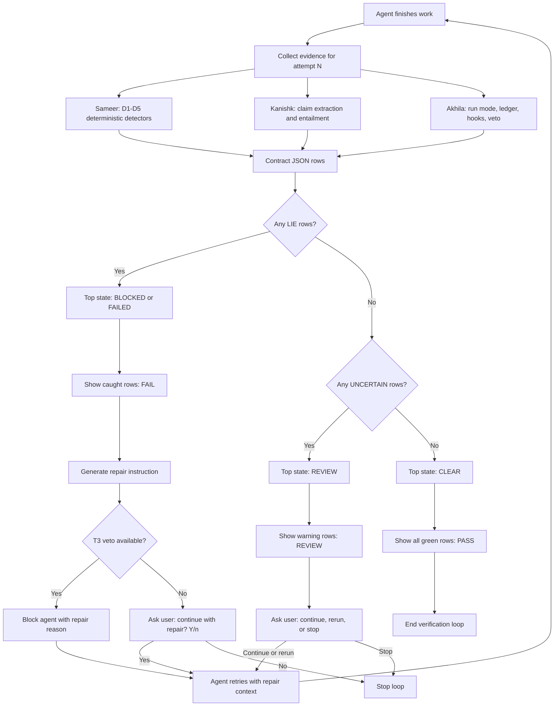

# Pinocchio Verification Loop

## UI States

- Row verdicts: `LIE`, `UNCERTAIN`, `VERIFIED`
- CLI labels: `FAIL`, `REVIEW`, `PASS`
- Top-level states: `BLOCKED` or `FAILED`, `REVIEW`, `CLEAR`
- Run modes: `T1` git diff, `T2` CLI ledger, `T3` veto/block

## Team Inputs

- Sameer feeds detector rows: `D1` through `D5`
- Kanishk feeds extracted claims, entailment rows, and optional Greptile witness rows
- Akhila feeds run mode, ledger/hook state, veto decision, and repair/block reason
- Alina renders the loop: attempt, checks, repair instruction, retry prompt, final state
